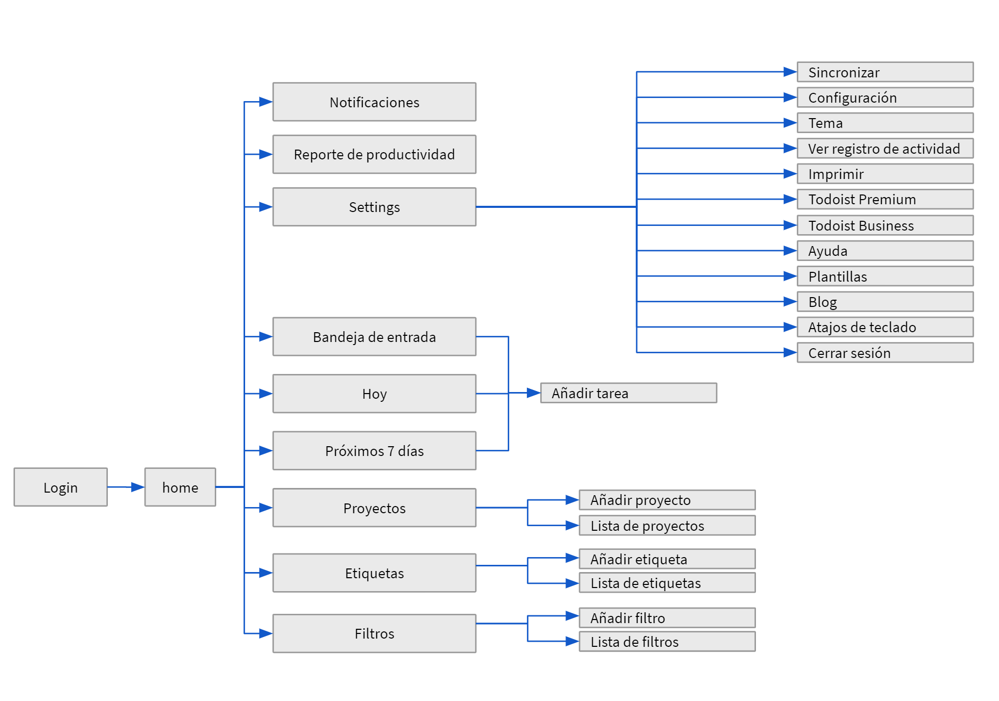

### Objetivo general.
Establecer un inventario de estados de la aplicación Todoist.com a la version de escritorio teniendo en cuenta la mayor cantidad posible de funcionalidades relevante en la versión actual.
### Enfoque de las pruebas.
Las presentes pruebas se van a enfocar en cubrir la mayor cantidad de escenarios, lo anterior decisión busca almacenar la máxima cantidad de estados de la aplicación en pro de tener un gran inventario base para un posterior procesos de regresión. Adicionalmente por tema de presupuesto se limitaran las pruebas a requerimientos funcionales.
Se elige realizar pruebas con cucumber dado que al crear cada step  de pruebas este se puede reutilizar en los archivos .feature y permite abarcar más escenarios de prueba con menor esfuerzo.
### Niveles y tipos de pruebas.
Las presentes pruebas se van a realizar a nivel de pruebas de aceptación, mediante el uso de pruebas BDD y pruebas exploratorias.

### Diagrama de navegación

  

### Demo de pruebas ejecutandose
